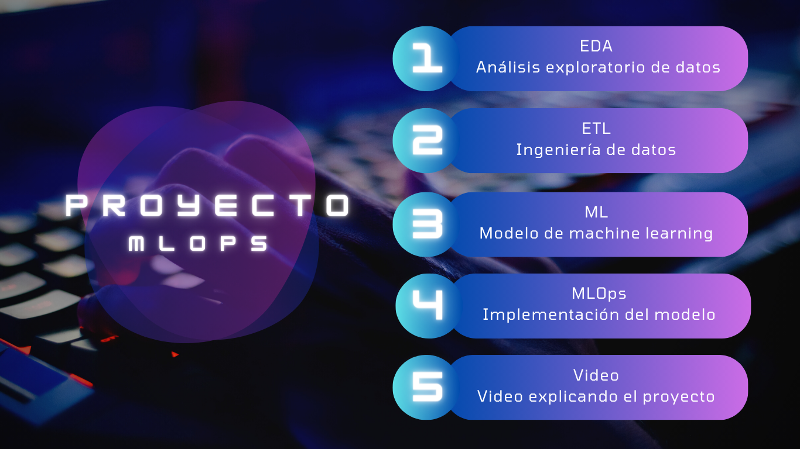

 

   

 

# Sistema de recomendación de videojuegos para usuarios de Steam

## Pagina web del proyecto

Le invitamos a visitar la página web del proyecto, donde podrá acceder al modelo de predicción, así como a los archivos originales con los que se llevará a cabo el trabajo. Además, encontrará información detallada sobre las diversas etapas del proyecto y podrá conocer al autor del mismo. Para acceder a la página, le proporcionamos el siguiente enlace:

 

  

## Descripción del Proyecto

Este proyecto se centra en el desarrollo de un sistema de MLOps, abarcando desde la ingeniería de datos hasta la implementación de modelos de aprendizaje automático.

 

## Contexto

[Steam](https://store.steampowered.com/?l=spanish), creada por Valve Corporation en 2003, es una plataforma de distribución digital de videojuegos inicialmente diseñada para actualizar automáticamente los juegos de Valve. Con el tiempo, se expandió para incluir juegos de otros desarrolladores. Aunque cuenta con más de 325 millones de usuarios y más de 25,000 juegos, las estadísticas precisas son limitadas desde 2018, ya que Steam restringió el acceso a datos detallados.

 

## Conjunto de datos

El proyecto parte de una carpeta con 3 archivos  que nos proporciona [HENRY](https://www.soyhenry.com/) para desarrollar el análisis:

* `australian_user_reviews.json` es un dataset que contiene los comentarios que los usuarios realizaron sobre los juegos que consumen, además de datos adicionales como si recomiendan o no ese juego, emoticones de gracioso y estadísticas de si el comentario fue útil o no para otros usuarios. También presenta el id del usuario que comenta con su url del perfil y el id del juego que comenta.

* `australian_users_items.json` es un dataset que contiene información sobre los juegos que juegan todos los usuarios, así como el tiempo acumulado que cada usuario jugó a un determinado juego.

* `output_steam_games.json` es un dataset que contiene datos relacionados con los juegos en sí, como los título, el desarrollador, los precios, características técnicas, etiquetas, entre otros datos.
 

Para acceder a la carpeta con los archivos hacer clik [aqui](https://drive.google.com/drive/folders/1HqBG2-sUkz_R3h1dZU5F2uAzpRn7BSpj).

 

## Objetivo

El objetivo principal es crear un flujo de trabajo eficiente que incluya la recopilación y transformación de datos, análisis exploratorio, desarrollo de modelos y su implementación utilizando prácticas de MLOps. 

Este proyecto simula el trabajo de un MLOps Engineer combinando las funciones de Data Engineer y Data Scientist para la plataforma Steam. Se requiere desarrollar un Producto Mínimo Viable que incluya una API en la nube y la implementación de dos modelos de Machine Learning: análisis de sentimientos en comentarios de usuarios y recomendación de juegos basada en nombre o preferencias de usuario.

 

## Etapas del Proyecto

 

### 1. Ingeniería de Datos (ETL)
En esta fase inicial, nos enfocamos en comprender los archivos recibidos, identificar el formato en el que se presentan y entender su contenido general. Para lograr esto, comenzamos revisando y analizando el "diccionario de datos de STEAM" para obtener una visión clara de lo que nos encontraremos. Durante este análisis, identificamos que dos archivos contienen datos anidados: la columna `reviews`en el archivo `user_reviews.gz.json` y la columna `items` en el archivo `user_items.gz.json`.

Una vez que el dataset está preparado, procedemos a extraer los archivos y llevar a cabo el proceso de Extracción, Transformación y Carga (ETL) en cada uno de ellos. Puede encontrar la Notebook Jupyter utilizada para realizar el ETL [Aqui](https://colab.research.google.com/drive/1wpoG_OeerKu2RNRqlkmaiyt9TrYebUN9?usp=drive_link).

Tras completar el proceso de ETL, los archivos se presentarán en un estado más organizado y limpio. Puede acceder a estos archivos mejorados haciendo clic [Aqui](https://drive.google.com/drive/folders/1qvEJ80g96ZBjeuiH_M_Nv5Mnr_GACZ0t?usp=drive_link). Esta fase nos permite avanzar hacia los siguientes pasos en el proyecto.

 

### 2. Análisis Exploratorio de Datos (EDA)
Se ha llevado a cabo un Análisis Exploratorio de Datos (EDA) en tres conjuntos de datos, los cuales fueron sometidos a un proceso de Extracción, Transformación y Carga (ETL). El propósito principal de este análisis fue identificar las variables cruciales para la creación de un modelo de recomendación efectivo. Durante este proceso, se hizo uso de la biblioteca Pandas para la manipulación de datos, mientras que las bibliotecas Matplotlib y Seaborn fueron empleadas para visualizar la información de manera clara y concisa.

 

### 3. Modelo de Aprendizaje Automático
En términos más técnicos, se utiliza un algoritmo basado en la memoria para abordar el problema del filtrado colaborativo. Este enfoque implica el análisis de toda la base de datos para encontrar juegos similares al juego proporcionado por el usuario activo. El algoritmo trata de identificar la similitud entre los juegos al utilizar la similitud del coseno como medida. La similitud del coseno es una técnica comúnmente empleada en sistemas de recomendación y análisis de datos para evaluar cuán similares son dos conjuntos de datos o elementos.

En el proceso, se representan los juegos como vectores en un espacio multidimensional, y la similitud del coseno se calcula mediante el coseno del ángulo entre estos vectores. Esto proporciona una medida cuantitativa de la similitud entre juegos, permitiendo al modelo generar recomendaciones basadas en juegos que comparten características similares.

 

### 4. Implementación del modelo
El progreso en el desarrollo de las consultas generales se visualiza en el siguiente Notebook [3_Funciones_para_fastAPI](https://colab.research.google.com/drive/1yUsLQ8KTOljGb2sF0GZGaSlYyWsSntkG?usp=drive_link), mientras que las funciones del modelo de recomendación están detalladas en [5_Modelo_de_recomendación](https://colab.research.google.com/drive/1PJsL7z7FPH19FrA7mg4ncRF1FIbpkci4?usp=drive_link).

Para implementar la API, el código correspondiente se encuentra en el archivo `main.py` de nuestro repositorio. Si deseas ejecutar la API localmente, sigue estos pasos:

* Clona el proyecto utilizando el comando:
     `git clone https://github.com/orestes-victor/HENRY_Proyecto_Individual_1_MLOps_Orestes_Victor.git`.

   
* Prepara el entorno de trabajo en Visual Studio Code: 

   
* Crea un entorno Python mediante: python -m venv env.

   
* Accede al entorno con: env\Scripts\activate.

   
* Instala las dependencias con: pip install -r requirements.txt.

   
* Ejecuta el archivo main.py desde la consola activando uvicorn. Para ello, utiliza el comando: uvicorn main:app --reload.

   
* Haz clic con Ctrl sobre la dirección http://XXX.X.X.X:XXXX (se muestra en la consola).

   
* En el navegador, añade /docs al final de la URL para acceder a ReDoc.

   
* Dentro de cada función, haz clic en "Try it out", luego introduce los datos necesarios o utiliza los ejemplos predeterminados.

   
* Finalmente, ejecuta y observa la respuesta.

   

## 4. Video Explicativo

En proceso

 

## Estructura del Repositorio

- **/Assets**: sirve para almacenar y organizar los archivos multimedia y otros recursos necesarios.
- **/Datasets**: Archivos necesarios donde consultará nuestro codigo principal.
- **/Notebooks**: Notebooks de Jupyter utilizados para la exploración y desarrollo.
- **gitignore**: Esto ayuda a mantener limpio el historial de versiones y evita incluir archivos innecesarios o sensibles en el repositorio.
- **main**: Código principal del proyecto para la API.
- **Readme**: Sirve como una guía rápida para comprender el proyecto y contribuir eficientemente.
- **requirements**: Librerias necesarias para que el modelo funcione en render.

 

## Requisitos de Instalación y Ejecución

En proceso

 

## Colaboradores

- Orestes Victor
